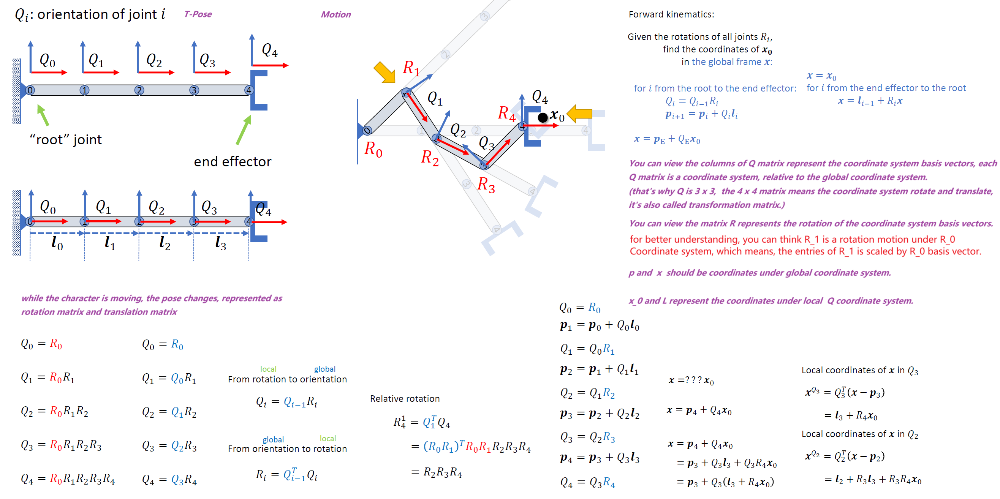
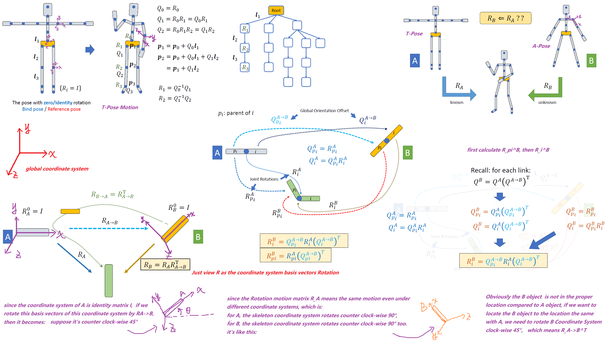
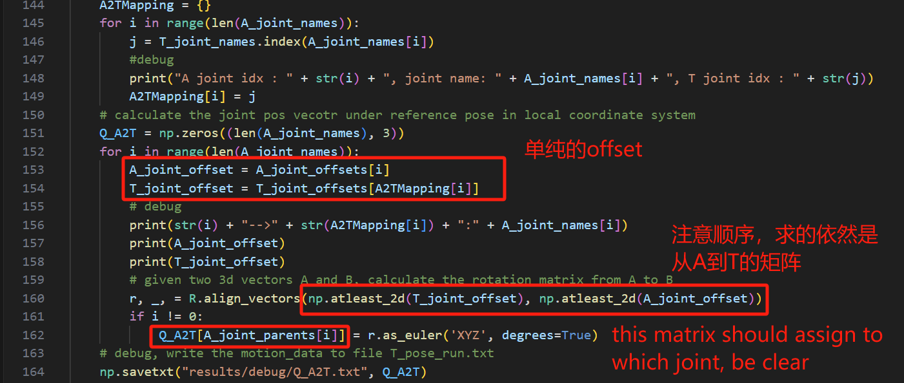
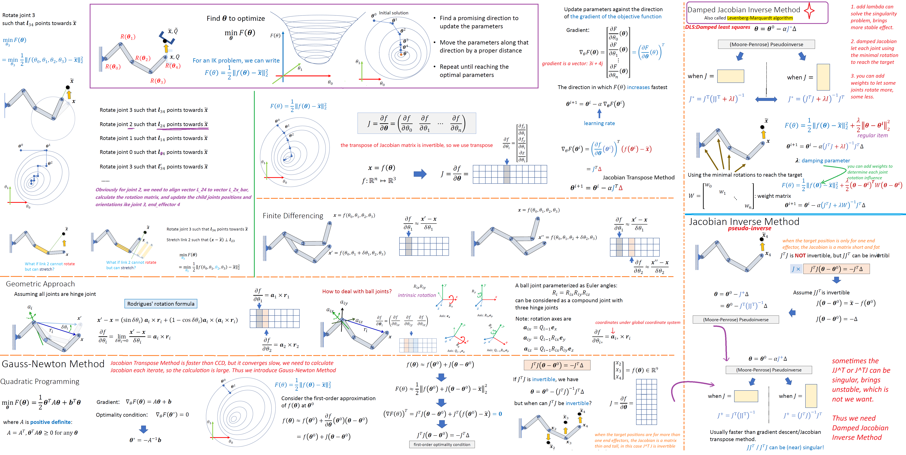
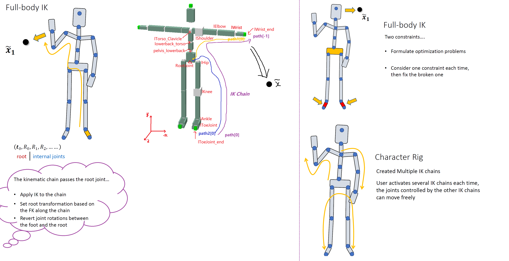
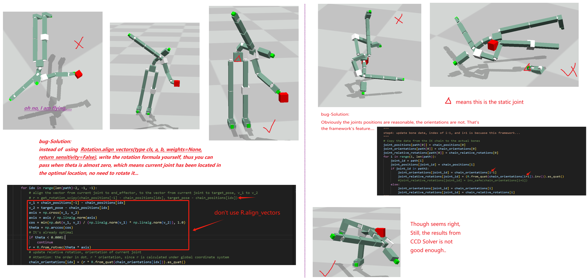

==right hand rule, column vector, left multiply==

## Task1 FK

### Part1 Read bvh file hierarchy

#### python language:

https://www.geeksforgeeks.org/convert-python-list-to-numpy-arrays/
https://www.w3schools.com/python/numpy/default.asp


#### method:
Read the bvh file line by line, using ```stack``` push ```joint_name```,  pop up stack element when read the `}` symbol, update the ```parent_name```, which is the ```top``` element of stack, ```parent_idx``` can be found in ```list``` ```joint_names```.

#### description:
this is the T-Pose data, the offset of each joint is relative to it's parent joint.

>joint_name: len(), 25
joint_offset: shape(), (25,3)
joint_parent: len(), 25
motion_data: shape(), (182, 63)

the motion data is in order as channel, first the root joint translation: XPos, YPos, ZPos(relative to global coordinate system), second the root joint rotation: XRot, YRot, ZRot(relative to global coordinate system), then the child joints rotation(relative to it's parent joint coordinate system)...

### Part2 FK Calculate


<div align="center">
 
</div>

>$Q$: Orientation, essentially it is a local skeletal coordinate system (in this joint)，$3 \times 3$ matrix $Q$ without translation, the colums in this matrix is basis vectors(xyz) under global coordinate system.

#### python language:
https://numpy.org/doc/stable/reference/generated/numpy.ndarray.tolist.html
https://docs.scipy.org/doc/scipy/reference/generated/scipy.spatial.transform.Rotation.__mul__.html#

#### method:
Use the formula in above <u>figure</u> to calculate ```joints position and orientation``` (under global coordinate system), 
use ```npdarry data``` structure to calculate matrxi multiplication, 
use ```scipy Rotation``` for conversion among three formats: ```Matrix, Euler, Quaterninon```, 

$$
euler \rightarrow quaterninon \rightarrow matrix \space multiplication\rightarrow quaterninon
$$
> Each fram motion calculation is relative to the global coordinate system and cur parent joint coordinate system, with no relation to previous frame motion

### Part3 Motion Retargeting (T-Pose & A-Pose)

<div align="center">
 
</div>

*To understand more about basis vectors*:

https://keneyr.com/Math/Linear-Algebra/Algebra-C4-Vector-Spaces/#Change-of-Basis


Obviously from the above figure, we find that if we want to get the same pose sequences, we need to calcuate the coordinate transform matrix from A to B, this problem can be abstracted as: 

*How to calcuate the rotation Matrix from Vector A to Vector B*?

https://docs.scipy.org/doc/scipy/reference/generated/scipy.spatial.transform.Rotation.align_vectors.html

https://math.stackexchange.com/questions/180418/calculate-rotation-matrix-to-align-vector-a-to-vector-b-in-3d

https://github.com/scipy/scipy/issues/16880

#### method:
1. use hash to record ```joint_id``` mapping from ```A rest pose``` to ```T rest pose```
2. calculate ```rotation matrix``` for each <u>joint coordinate system basis vectors</u> from ```A to T reference pose``` , one thing to remeber, the ```r, _, = R.align_vectors(np.atleast_2d(T_joint_offset), np.atleast_2d(A_joint_offset))```, the offsets are relative offset
3. calibrate the motion(rotation) matrix from ```R_A``` to ```R_B```

## Task1 FK Funny Bug Fix

<div align="center">
 
</div>


## Task1 IK

### Static Inverse Kinematics

Writing correct IK code requires a deeper understanding of linear algebra, you can see these videos from 3Blue1Brown:
https://www.youtube.com/watch?v=P2LTAUO1TdA&list=PLZHQObOWTQDPD3MizzM2xVFitgF8hE_ab&index=13

> <u>For my purposes</u>, the column vectors in any matrix are considered to be the positions of the updated basis vector. So always have an ==absolute coordinate system== in mind, which is the <u>identity matrix</u>. The final data and rendering should occur under absoluate coordinate system. 

#### python language:
https://stackoverflow.com/questions/3940128/how-do-i-reverse-a-list-or-loop-over-it-backwards

```python
for idx, joint_id in reversed(list(enumerate(path))):
range(start, stop [, step])
```
#### rotation:
https://math.stackexchange.com/questions/360286/what-does-multiplication-of-two-quaternions-give

<div align="center">
 
</div>

#### method:

==Attention:== ```root_joint```, denotes as ```path[0]```means this joint doesn't change it's position and orientation.


##### IK-simple
```python
# IK Chain-simple: path[] = [RootJoint ...... lWrist_end]
# step1. init chain
iterate path[]: (RootJoint to lWrist_end)
    joint i:
        position[i]: coordinates under global coordinate system
        orientation[i]: orientation under global coordinate system
        relative_rotation[i]: orientation[pi] *  relative_rotation[i] = orientation[i]
        relative_offset[i]: the same with bvh file
# step2. change chain, pj is the parent of j in this chain
reverse iterate path[]: (lWrist to RootJoint)
    joint i:
        align vector v1 to v2, calculate the align rotation as r 
        (v1: [pos[i], pos[-1], v2: [pos[i], target_pose])

        update i orientation: orientation[i] = r * orientation[i]
        update i relative_rotation: relative_rotation[i] = orientation[pi].inv() * orientation[i]
        
        update orientations and positions of i 's children joints j:
            orientation[j] = orientation[pj] * relative_rotation[j]
            position[j] = position[pj] + orientation[pj] * relative_rotation[j]
# step3. apply chain values to actual joint data, parent_j is the real parent of j in human body
for joint j:
    joint_pos[j] = chain_pos[.]
    joint_ori[j] = chain_ori[.]
    joint_relative_rotation[j] = chain_relative_rotation[.]
    # special judgement
    if this joint j is at index 0 of path, like RootJoint in this case:
        joint_relative_rotation[j] = joint_ori[parent_j].inv() * joint_ori[j]
# step4. FK calculate, iterative body from RootJoint
for joint j:
    joint_ori[j] = joint_ori[parent_j] * joint_relative_rotation[j]
    joing_pos[j] = joint_pos[parent_j] + joint_ori[parent_j] * relative_offset[j]
```
##### IK-hard
```
path = [23,10,8,6,4,0,1,2,13,15,17,19,21]
corresponding joint names are:
['lToeJoint_end','lToeJoint','lAnkle','lKnee','lHip', 'RootJoint', 'pelvis_lowerback', 'lowerback_torso', 'lTorso_Clavicle', 'lShoulder', 'lElbow', 'lWrist','lWrist_end']
```

```python
#  one thing to remeber, 
#  the parent-child relation in IK Chain in the lower body part 
#  is opposite compared to real skeleton parent-child relation
```
<div align="center">
 
</div>

### IK + BVH

### Bonus : Two target_pose IK


## Task2 IK Funny Bug Fix

<div align="center">
 
</div>

