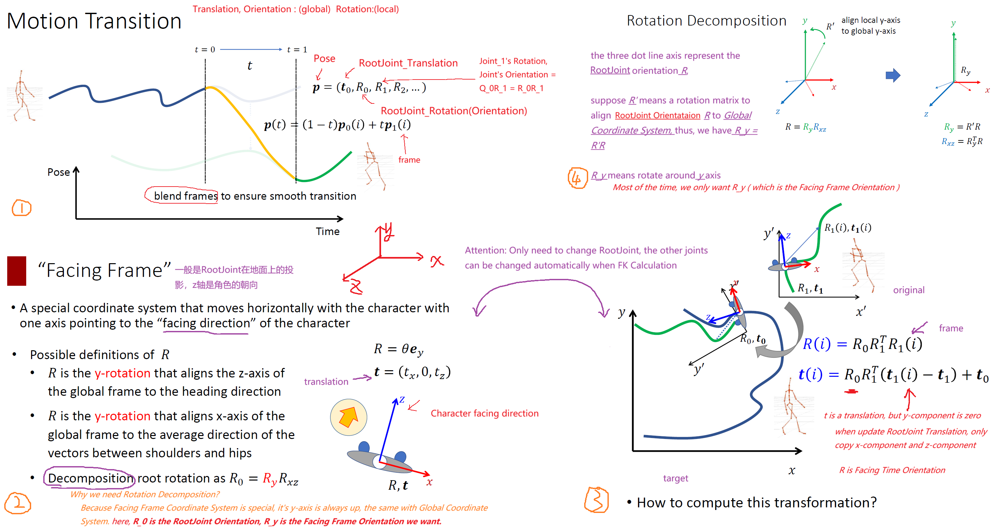
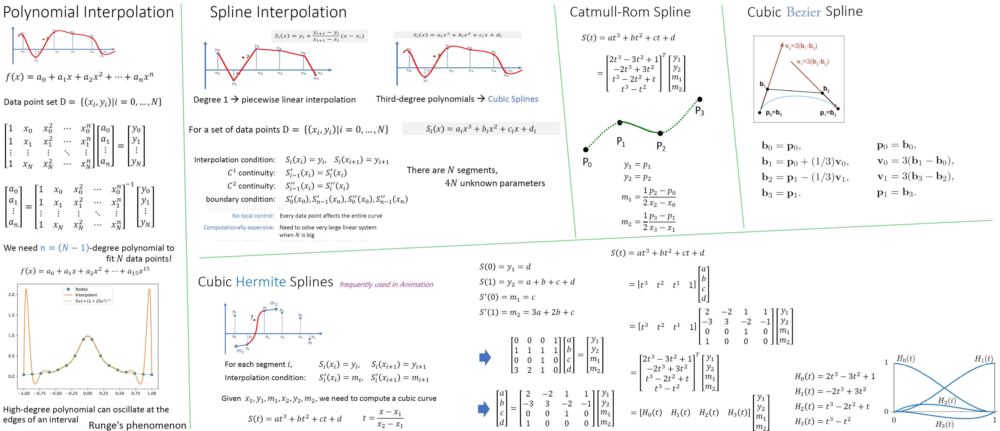
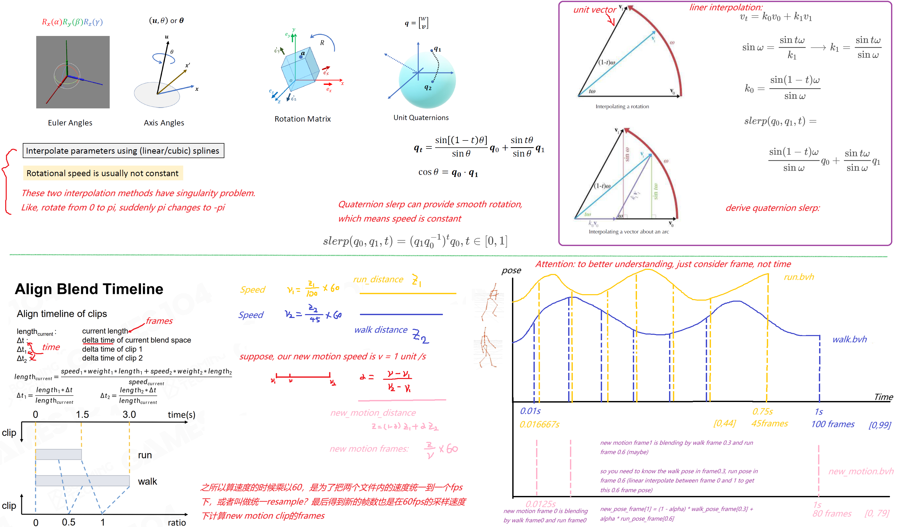

## Task 1 Simple Motion processing

In this framework, `position`，`rotation` is local position and rotation，`translation`,`orientation` is global position and rotation。

### Translation and Orientation

Adjust the `Character Position and Orientation`, but this character still does the `same walk motion` as described in `walk.bvh file`

 

#### method:

1. `decompose` cur `RootJoint orientation` $R$ to $R_yR_{xz}$
2. $R_y$ is the `face_time_original_orientation`
3. `face_time_target_orientation` is the target character <u>face time coordinate system</u>
4. Apply the <u>formula</u> described in above figure to RootJoint orientation and position each frame.

### Motion Interpolation

First, you need to understand kinds of interpolation fomula, like polynomial interpolation, spline interpolation, bezier interpolation, etc. https://keneyr.com/Math/Geometry/Geometry-Curves/

back to games105 courses, I still summarize position interpolation as follows:

 

also, the rotation interpolation can use `slerp` function of quaternion to keep constant speed:

 

#### method:

Just as above figure shows, given the walk clip and run clip, we want to blend these two motions and get a new motion clip.
1. calculate new motion clip frames, calculate the blending_weights
2. for each new motion clip frame, calcuate the corresponding frames in walk bvh clip and run bvh clip
3. usually the corresponding frame index is not stored in data, in this case, you need to interpolate to get correspongding frame pose
4. blending

#### python:

https://docs.scipy.org/doc/scipy/reference/generated/scipy.spatial.transform.Slerp.html
https://docs.scipy.org/doc/scipy/reference/generated/scipy.spatial.geometric_slerp.html

### Loop animation

https://theorangeduck.com/page/creating-looping-animations-motion-capture

### Motion Blend

#### method:

we want to have a smooth transition from walk to run, which means we need a proper frame begin motion blending.

1. change motion_1 to loop animation, change motion_2 to loop animaiton
2. find the similar pose in motion_2 compared to mix_frame in motion_1.
3. change motion_2 face_time coordinate system to motion_1 face_time coordinate system (means change facing direction and face_time position)
4. interpolate joint positions and rotations, the alpha is from 0 to 1.

## Task 2 Interactive Character Animation

This part will realize an interactive character animation, that is, through the interpolation, blending and combination of motion capture data to realize the corresponding action of the virtual character according to the control of the keyboard/handle.

Obviously, it is common to use State Machine and Motion Matching method implementing interactive animation in Computer Games.

### State Machine

### Motion Matching

### Learning-based Method

