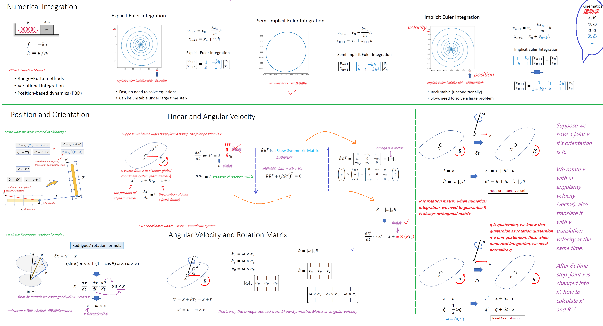
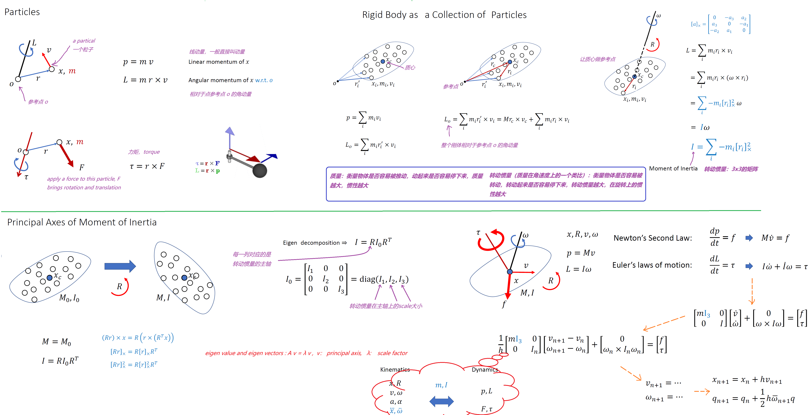
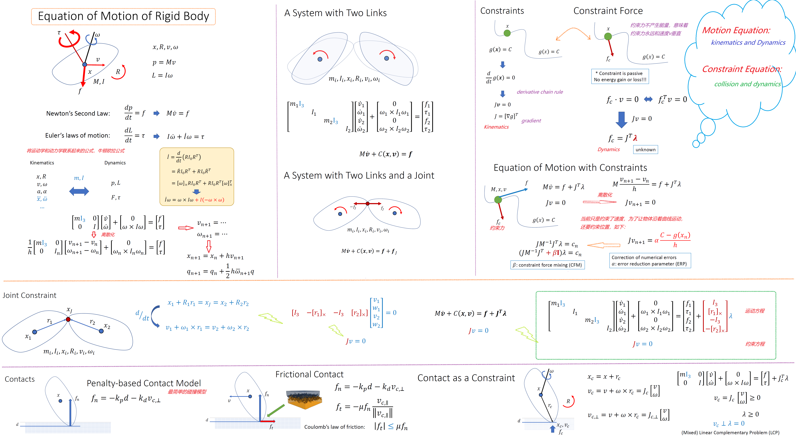
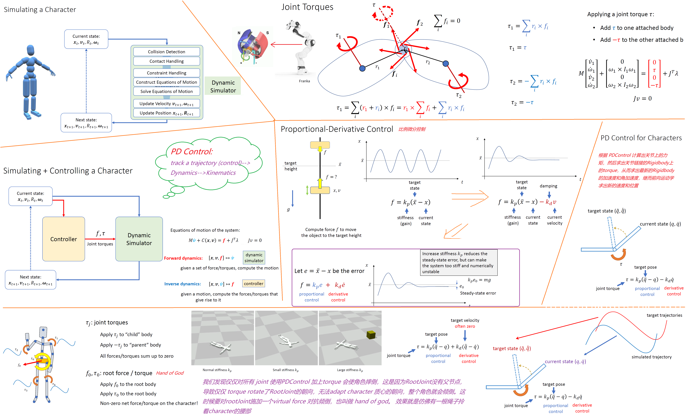

## Task1: Stand up control

There are lots of Definitions you need to know before this experiment:

>1. what is velocity? what is angular velocity?

<p align=center>
 
</p>

>2. what is torque, what is momentue?

<p align=center>
 
</p>

>3. what is the rigidbody motion equation?

<p align=center>
 
</p>


https://digitalopus.ca/site/pd-controllers/

### part1 PD Control


#### Attention

> 注意，`quaternion_target - quaternion_current`不是标量减法，这个意思是求这两个朝向之间的差距，我们知道对于四元数旋转来讲：`quaternion_1 = quaternion_difference * quaternion_0`.

> 很明显，有一个问题就是PDControl里的公式，怎么把 quaternion 变成一个torque vector的？

```python
diff_rot =  R.from_quat(joint_target_local_rot).__mul__(R.from_quat(joint_cur_local_rot).inv())
delta_rot = diff_rot.as_quat()
s = R.from_quat(delta_rot).as_rotvec()
local_torque = kp * s - kd * joint_avel[i]
```


>4. what is PD Control?
<p align=center>
 
</p>


### part2: Hand of God

easy, just add a force to RootJoint:

```python
global_root_force = kp * (target_position - root_position) - kd * root_velocity
```

### part3: Static Balance

??

## Task2: Walk Control(Bonus)

