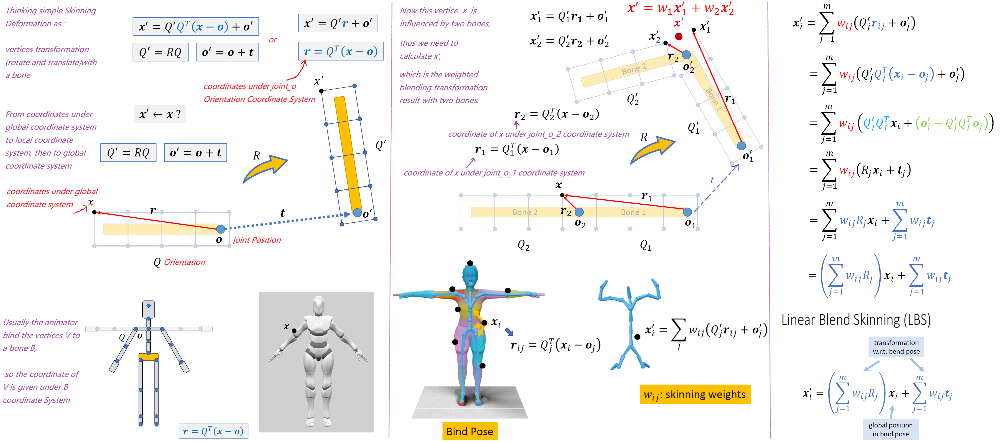
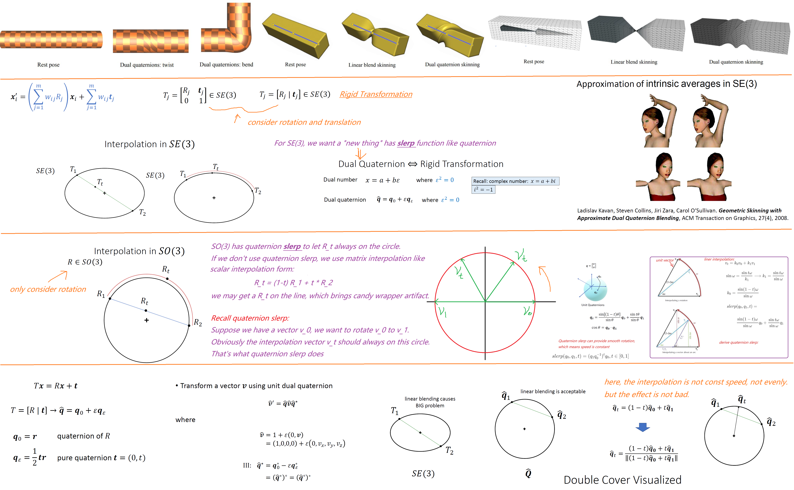

Method:

https://keneyr.com/Graphics/Animation/Animation-C14-Skinning/#Candy-Wrapper-Artifact


Numpy,Scipy:

https://zhuanlan.zhihu.com/p/396444973
https://www.programiz.com/python-programming/numpy/fancy-indexing
https://numpy.org/doc/stable/reference/generated/numpy.reshape.html
https://stackoverflow.com/questions/7717380/how-to-convert-2d-list-to-2d-numpy-array
https://docs.scipy.org/doc/scipy/reference/generated/scipy.spatial.transform.Rotation.as_matrix.html
https://stackoverflow.com/questions/26089893/understanding-numpys-einsum
https://ajcr.net/Basic-guide-to-einsum/


```python
import numpy as np

skinning_weight = np.array([[[1, 0, 0, 1]],[[2,0,0,0]]]) #(2,1,4)
rotation_matrix = np.array([[[[1,2,3],[4,5,6],[7,8,9]], [[1,2,3],[4,5,6],[7,8,9]], [[1,2,3],[4,5,6],[7,8,9]], [[1,2,3],[4,5,6],[7,8,10]]], [[[1,2,3],[4,5,6],[7,8,9]], [[1,2,3],[4,5,6],[7,8,9]], [[1,2,3],[4,5,6],[7,8,9]], [[1,2,3],[4,5,6],[7,8,9]]]]) #(2,4,3,3)

print(skinning_weight.shape)
print(rotation_matrix.shape)

blending_rotation = np.einsum('ijk,ikcd->icd', skinning_weight, rotation_matrix)
print(blending_rotation)
print(blending_rotation.shape)

"""
(2, 1, 4)
(2, 4, 3, 3)
[[[ 2  4  6]
  [ 8 10 12]
  [14 16 19]]

 [[ 2  4  6]
  [ 8 10 12]
  [14 16 18]]]
(2, 3, 3)
"""
```

= = |||

My best speed is 9fps, 

I will update the code as I figure out a better way...

<p align=center>
 
</p>

<p align=center>
 
</p>

<p align=center>
 
</p>


